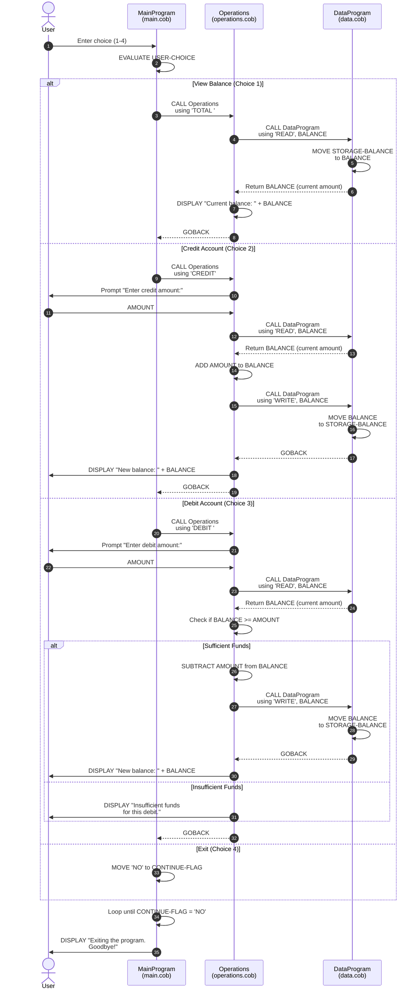

# Account Management System — COBOL Source Documentation

## Overview

This project implements a simple bank account management system written in COBOL.
It allows users to view their balance, credit funds, and debit funds through an
interactive console menu.

---

## File Descriptions

### `src/cobol/main.cob` — Entry Point (`MainProgram`)

The main program that drives the interactive menu loop.

**Key logic:**
- Displays a numbered menu with four options: View Balance, Credit Account, Debit Account, and Exit.
- Accepts user input (1–4) and delegates each action to the `Operations` sub-program via `CALL`.
- Loops continuously using `PERFORM UNTIL CONTINUE-FLAG = 'NO'` until the user selects Exit.

| Menu Option | Action |
|-------------|--------|
| 1 | View Balance → calls `Operations` with `'TOTAL '` |
| 2 | Credit Account → calls `Operations` with `'CREDIT'` |
| 3 | Debit Account → calls `Operations` with `'DEBIT '` |
| 4 | Exit → sets `CONTINUE-FLAG` to `'NO'` |

---

### `src/cobol/operations.cob` — Business Logic (`Operations`)

Handles all account operations. Called by `MainProgram` with an operation type
passed via the `LINKAGE SECTION`.

**Key logic:**

| Operation | Behaviour |
|-----------|-----------|
| `TOTAL ` | Reads the current balance from `DataProgram` and displays it. |
| `CREDIT` | Prompts for an amount, reads the current balance, adds the amount, and writes the updated balance back. |
| `DEBIT ` | Prompts for an amount, reads the current balance, and subtracts the amount only if sufficient funds exist; otherwise displays an insufficient-funds message. |

**Business rules:**
- A debit is only applied when `FINAL-BALANCE >= AMOUNT`; otherwise the transaction is rejected with the message *"Insufficient funds for this debit."*
- Operation type codes are fixed-length 6-character strings (note the trailing spaces on `'TOTAL '` and `'DEBIT '`).
- The default working balance is initialised to `1000.00`.

---

### `src/cobol/data.cob` — Data Access Layer (`DataProgram`)

Acts as an in-memory data store for the account balance. Called by `Operations`
with an operation type and a balance value via the `LINKAGE SECTION`.

**Key logic:**

| Operation | Behaviour |
|-----------|-----------|
| `READ` | Copies `STORAGE-BALANCE` into the passed `BALANCE` parameter. |
| `WRITE` | Copies the passed `BALANCE` parameter into `STORAGE-BALANCE`. |

**Business rules:**
- The initial account balance is hard-coded to `1000.00`.
- Balance is stored as `PIC 9(6)V99` — a numeric field supporting values up to `999999.99` with two decimal places.
- Data persists only for the lifetime of the running process (in-memory; no file or database persistence).

---

## Program Call Hierarchy

```
MainProgram (main.cob)
└── Operations (operations.cob)
    └── DataProgram (data.cob)
```

---

## Business Rules Summary

1. **Initial balance** — Every session starts with a balance of `1000.00`.
2. **Overdraft protection** — Debit transactions that would result in a negative balance are rejected.
3. **No persistence** — Account data is not written to disk; balances reset on each program run.
4. **Input validation** — The main menu rejects any choice outside `1–4` and prompts the user again.

---

## Data Flow Sequence Diagram

The following diagram shows the interaction sequence for a typical account operation:


